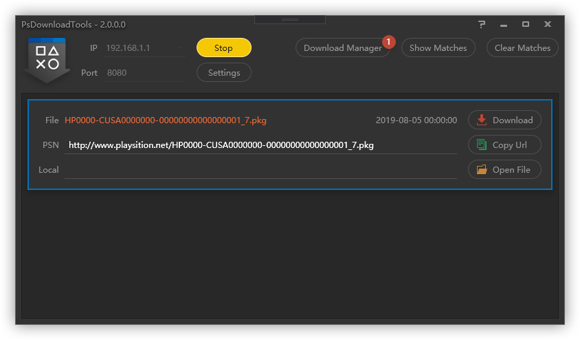

# PsDownloadTools
### Version: 2.0.0 
### Developer: Void Studio 

When set up in the same network and with the correct proxy configuration, this software can intercept specific traffic to obtain the addresses of game package files, so you can download them using the builtin aria2 download tool or any other download program you preferred, then upload the package files back to your gaming devices to speed up the download process.

当电脑与游戏设备在同一网络中且设置好相应的代理时，本程序可以截获游戏包文件的下载地址。你可以用程序内置的aria2下载工具，或任何你喜欢的下载程序进行下载，然后将包文件回传至游戏设备，以绕过直连psn缓慢的网速，达到加速下载的目的。

### License:
This project is released under the AGPLv3 License for non-commercial use only, and can not be used for commercial purposes.
In addition to the AGPLv3 License, all restrictions listed below should be followed:
1. **NON PROFITABLE:** This is a free, open source project. No charge should be made in exchange for the software itself or any service the software provides.
2. **RESERVED INFORMATION:** When code is modified or released, information of the original developer (Void Studio) and license (include additional restrictions) should be kept.

### 授权协议:
本项目遵循AGPLv3协议，仅限非商业使用，禁止商业用途。
在AGPLv3协议基础上，亦应遵守下列附加限制：
1. **禁止盈利：** 这是一个免费、开源的项目，不得对该软件本身或该软件提供的任何服务收取费用。
2. **保留信息：** 若对本项目代码进行修改或重新发布，必须保留原开发者信息（Void Studio）及授权协议信息（包括附加限制）。

### Notice:
1. **NO WARRANTY:** This project is not tested thoroughly and may contain unpredictable glitches or bugs, use it at your own risk.
2. **DISCLAIMER:** Any file and information (include but not limited to .pkg package files, filenames and links) obtained from this software belongs to Sony Entertainment Network or its own distributor, and should not be used for any purposes other than uploading back to the gaming devices. 

### 声明:
1. **无保声明：** 本项目未经过严格的、全面的测试，可能含有不可预知的错误，请自担风险，酌情使用。
2. **免责声明：** 任何通过本软件获取的文件和信息（包括但不限于.pkg格式的游戏包文件，文件名及网络连接）均属于Sony Entertainment Network或其发行商，不得用于除回传至游戏设备外的其他用途。
